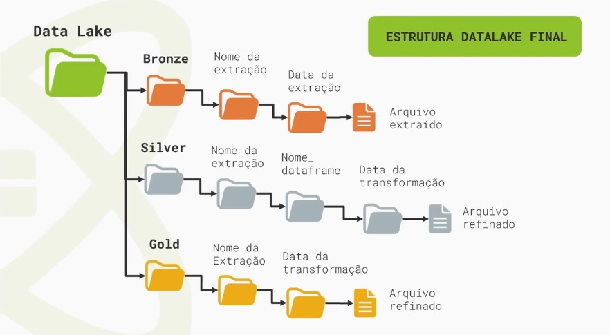

<!-- TOC start (generated with https://github.com/derlin/bitdowntoc) -->

- [ETL Pipeline with Apache Airflow and Spark](#etl-pipeline-with-apache-airflow-and-spark)
  - [Overview](#overview)
    - [Extraction](#extraction)
      - [Original Schema of Raw Data (Bronze)](#original-schema-of-raw-data-bronze)
    - [Transformation](#transformation)
    - [Load](#load)
      - [Schema at the End of the Pipeline (Gold)](#schema-at-the-end-of-the-pipeline-gold)
      - [Result dataframe](#result-dataframe)
  - [Technologies Used](#technologies-used)
  - [Requirements](#requirements)
  - [Installation](#installation)
    - [Start/Stop Services](#startstop-services)

<!-- TOC end -->

<!-- TOC --><a name="etl-pipeline-with-apache-airflow-and-spark"></a>

# ETL Pipeline with Apache Airflow and Spark

This repository contains a study project on Apache Airflow and Spark tools, developed during [Alura's Apache Airflow Training](https://www.alura.com.br/formacao-apache-airflow). The unique aspect of this project is the use of containers for the execution environment.

<!-- TOC --><a name="overview"></a>

## Overview

The project implements a DAG named **TwitterDAG**, which is an ETL (Extract, Transform, Load) data pipeline. This pipeline queries the API <https://labdados.com> that simulates Twitter data, downloads the data for a specific term, and organizes the results into progressively refined directories and dataframes.


The datalake adopts the standard medal structure, containing three directories:

- `bronze` for raw data,
- `silver` for processed data,
- `gold` for the final and refined data.



<!-- TOC --><a name="extraction"></a>

### Extraction

The first stage of the pipeline is extraction, which uses the **TwitterHook** (a custom HttpHook) to make requests to the API labdados.com. The **TwitterOperator** is responsible for organizing the API results in the `data/bronze` directory.

<!-- TOC --><a name="original-schema-of-raw-data-bronze"></a>

#### Original Schema of Raw Data (Bronze)

```markdown
root
 |-- data: array (nullable = true)
 |    |-- element: struct (containsNull = true)
 |    |    |-- author_id: string (nullable = true)
 |    |    |-- conversation_id: string (nullable = true)
 |    |    |-- created_at: string (nullable = true)
 |    |    |-- edit_history_tweet_ids: array (nullable = true)
 |    |    |    |-- element: long (containsNull = true)
 |    |    |-- id: string (nullable = true)
 |    |    |-- in_reply_to_user_id: string (nullable = true)
 |    |    |-- lang: string (nullable = true)
 |    |    |-- public_metrics: struct (nullable = true)
 |    |    |    |-- like_count: long (nullable = true)
 |    |    |    |-- quote_count: long (nullable = true)
 |    |    |    |-- reply_count: long (nullable = true)
 |    |    |    |-- retweet_count: long (nullable = true)
 |    |    |-- text: string (nullable = true)
 |-- includes: struct (nullable = true)
 |    |-- users: array (nullable = true)
 |    |    |-- element: struct (containsNull = true)
 |    |    |    |-- created_at: string (nullable = true)
 |    |    |    |-- id: string (nullable = true)
 |    |    |    |-- name: string (nullable = true)
 |    |    |    |-- username: string (nullable = true)
 |-- meta: struct (nullable = true)
 |    |-- next_token: string (nullable = true)
 |-- extract_date: date (nullable = true)
```

<!-- TOC --><a name="transformation"></a>

### Transformation

The second stage is transformation, which employs the **SparkSubmitOperator** and the script `/src/include/spark/transformation.py`. This stage processes the raw data and organizes it into two Spark dataframes tweets and users, thus forming the `silver` layer of the datalake.

<!-- TOC --><a name="load"></a>

### Load

The third stage would be the load, but in this example, it is limited to generating a dataframe with summarized data, constituting the `gold` layer of the datalake. This processing also uses the **SparkSubmitOperator**, executing the script `/src/include/spark/insight_tweet.py`.

<!-- TOC --><a name="schema-at-the-end-of-the-pipeline-gold"></a>

#### Schema at the End of the Pipeline (Gold)

```markdown
root
 |-- created_date: date (nullable = true)
 |-- n_tweets: long (nullable = false)
 |-- n_like: long (nullable = true)
 |-- n_quote: long (nullable = true)
 |-- n_reply: long (nullable = true)
 |-- n_retweet: long (nullable = true)
 |-- weekday: string (nullable = true)
```

<!-- TOC --><a name="result-dataframe"></a>

#### Result dataframe

```markdown
+------------+--------+------+-------+-------+---------+-------+
|created_date|n_tweets|n_like|n_quote|n_reply|n_retweet|weekday|
+------------+--------+------+-------+-------+---------+-------+
|  2024-03-24|       6|   255|    282|    321|      230|    Sun|
|  2024-03-25|       4|   201|    272|    170|      182|    Mon|
+------------+--------+------+-------+-------+---------+-------+
```

<!-- TOC --><a name="technologies-used"></a>

## Technologies Used

This project includes:

- Containerized environment using Docker and Docker Compose.
- A devcontainer for VSCode users.
- Python 3.8 environment.
- Airflow 2.8.0.
- apache-airflow-providers-apache-spark 4.7.1.
- PySpark 3.3.1.

<!-- TOC --><a name="requirements"></a>

## Requirements

- git
- Docker + Docker Compose
- Vscode with devcontainer extension

<!-- TOC --><a name="installation"></a>

## Installation

Git clone and directory creation.

```bash
git clone https://github.com/glaubervila/airflow-spark.git \
&& mkdir -p airflow-spark/logs airflow-spark/data \
&& sudo chown -R 1000:0 airflow-spark \
&& chmod -R g+w airflow-spark \
&& cd airflow-spark \
&& echo -e "AIRFLOW_UID=$(id -u)" > .env \
&& docker compose build \
&& docker compose up airflow-init
```

Import connections

```bash
docker compose run -it --rm airflow-cli airflow pools import /home/airflow/workspaces/airflow-spark/src/config/pools.json
```

<!-- TOC --><a name="startstop-services"></a>

### Start/Stop Services

All services can be started using the compose up -d command. NOTE: The web interface is configured for port 80. If necessary, edit the docker-compose.yml and change the port.

```bash
docker compose up -d
```

Or access the folder with VSCode and start the devcontainer.

```bash
docker compose stop
```

access <http://localhost> through the browser and use the default username **airflow** with the password **airflow**

If you need any further assistance, feel free to ask!
# airflow-celery-yfinance
