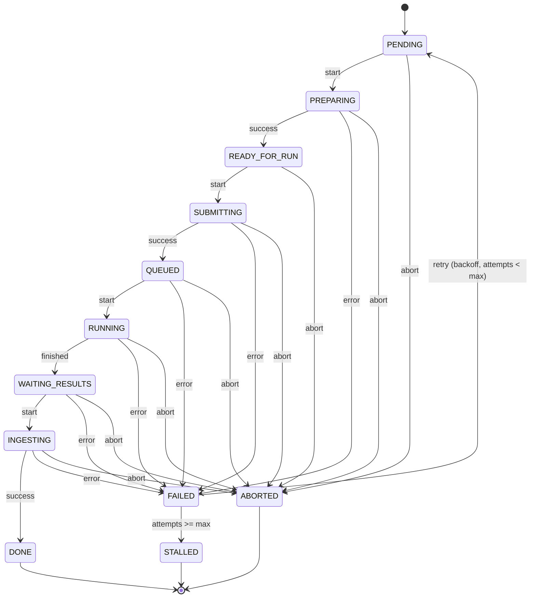

## Como usar

1. Criar algumas tasks:

```bash
python manage.py enqueue_predictions --count 3
```

2. Rodar os workers em terminais diferentes:

```bash
python manage.py prepare_worker
python manage.py submit_worker
python manage.py ingest_worker
```

Ciclo normal (sucesso)

`PENDING → PREPARING → READY_FOR_RUN → SUBMITTING → QUEUED → RUNNING → WAITING_RESULTS → INGESTING → DONE`

FAILED é só transição temporária → reentra em PENDING se ainda pode tentar.

STALLED é falha terminal → só ação manual (ex: reset).

ABORTED pode ocorrer em qualquer etapa → terminal.

O retry/backoff está ligado ao FAILED → PENDING.


## Fluxo de retry automático

- Se falhar em qualquer etapa:
  
  - Vai para FAILED.

  - Se attempt_count < max_retries, a task retorna para PENDING após delay com exponential backoff e incrementa as tentativas.

  - Se attempt_count >= max_retries, vai para STALLED.

- Retry manual via admin ou retry_prediction zera contador e força reprocessar.

- exponential backoff  
    1ª falha → next_retry_at = agora + 1 min

    2ª falha → next_retry_at = agora + 2 min

    3ª falha → next_retry_at = agora + 4 min

    4ª falha → STALLED definitivo

## Abort

Uma task em qualquer estado (exceto DONE, STALLED) pode ir para ABORTED.

Abort força término imediato → nunca retorna.


## TODO: Soft kill 
tratar o que acontece quando uma task é interrompida, no momento ela acaba ficando no status intermediario sem avançar para proxima etapa e sem considerar como falha, deveria mudar o status para falha e reinicar ou mudar para o status inicial. 

## Diagrama em Mermaid



## State Machine 

- PENDING = Tarefa recem criada aguardando para ser iniciada. 
- PREPARING = Primeira etapa do pipeline foi iniciada, criação de diretório e inputs. 
- READY_FOR_RUN = está pronta para segunda etapa, que é a submissão ao slurm. 
- SUBMITTING = Inicio da segunda etapa, a tarefa sera enviada para a api do slurm. 
- QUEUED = Task foi inserida na fila do slurm. 
- RUNNING = Uma das cpus do cluster iniciou a tarefa. 
- WAITING_RESULTS = Tarefa executada no cluster finalizou. e os resultados estão prontos para serem ingeridos. 
- INGESTING = Inicio da terceita etapa, registro dos resultados no banco de dados. 
- DONE = Indica que a tarefa foi finalizada com sucesso. 
- FAILED = Indica que a tarefa falhou em qualquer uma das etapas, mas que sera executada novemente pelo retry. ( A taks não vai ter o status FAILED explicito, mas sim o status PENDING + next_retry != None + attempt_cout > 0) 
- STALLED = Indica que a tarefa esgotou os retries e continuou com falha, e não será mais executada. 
- ABORTED = Indica que tarefa foi cancelada pelo usuario e não será executada independente da etapa que ela estiver.