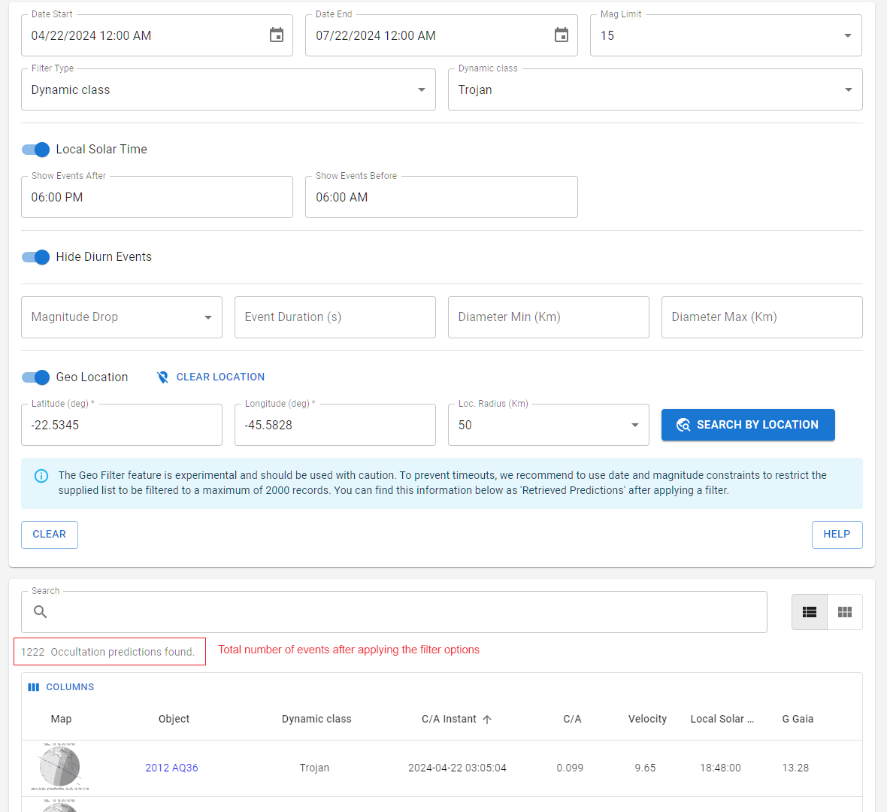

# Filtering events

The web dashboard offers intuitive customization for exploring occultation predictions, enabling users to easily adjust settings such as date and time, star magnitude limits, geolocation, among other filters. This approach makes advanced filtering of occultation accessible to everyone.

### Date and Time Interval

Allows you to select a specific time and date interval.

User may input the **Start date and time** and **End date and time** (format MM/DD/YYYY HH:MM AM/PM), or select the dates in the pop icon at the right of the respective search fields.

**Be aware that the date selection is based on your LOCAL TIME (timezone of the device) while the closest approach of occultations is given in UTC.**

### Magnitude Limit

Provides an upper magnitude limit for the occulted star.

Star magnitudes range from 4 to 18.

### Filter Type

There are four ways of filtering objects: ''empty'', by name/principal designation, dynamical class, and dynamical subclass:

- **Empty**: no filter is applied. All objects (as specified in the latest release) will be listed.
- **Object name**: type or search for the name of the object from the drop-down list, then select it. You can search and select for multiple objects. If the name of the object does not appear on the drop-down list, it means that there are no occultations available for that object at the time.
- **Dynamical class**: selects the group of objects that belong to a specific dynamical class.
- **Dynamical subclass**: selects the group of objects that belong to a specific subclass.

  Note that Asteroid dynamical classes (and subclasses) are used as defined by Skybot ([more information](https://ssp.imcce.fr/webservices/skybot/)).
  
### Local Solar Time

On by default. When activated, it takes a step further in constraining the closest approach instant to a specific local time (in terms of longitude). Selecting a time range from 6 PM to 6 AM will filter out all events whose closest approach instant is not within this range. This helps, for example, to filter out events occurring during dawn, dusk, or less interesting events whose closest approach occurs at daylight. It strictly considers solar time, not to be confused with the local time taking into account timezones.

### Hide Diurn Events

On by default, it filters out occultations whose paths happen exclusively during daytime and paths that do not cross the Earth at all.

### Duration and Size

Provide options to filter events by four parameters:
- **Magnitude drop**: the expected magnitude drop (lower limit).
- **Event duration**: the total event duration (lower limit, filters only when the object's diameter is defined).
- **Uncertainty**: the closest approach uncertainty in km.
- **Diameter**: minimum and maximum object size (filters only when the object's diameter is defined).

### Geolocation Filter

_The geolocation filter is experimental and is intended to be the last filter option to be applied._ Since it is computationally costly, we recomend to filter down your results using the previous filtering options to an amount of **at most 2000 events** as indicated in the image below. It can be acomplished for instance using a narrower datetime interval or set of objects.

Off by default. When activated, it takes a step further in constraining the closest approach instant to a specific location, in terms of latitude, longitude, and locarion radius. 

Latitude and longitude must be presented in degrees. Negative latitudes correspon to the South, while positive ones are to the North. Negative longitudes correspond to the West, while positive ones are the East.

The Location radius represents the distance in kilometers around the provided latitude and longitude for the occultation path.

> **Atention** > Be aware that activating this filter without following the instructions will result either in incomplete results or in timeout by the server.

### CLEAR and HELP buttons

The **CLEAR** button will clear all the input filters, reseting to the default values.

The **HELP** button will forward to this documentation URL.
