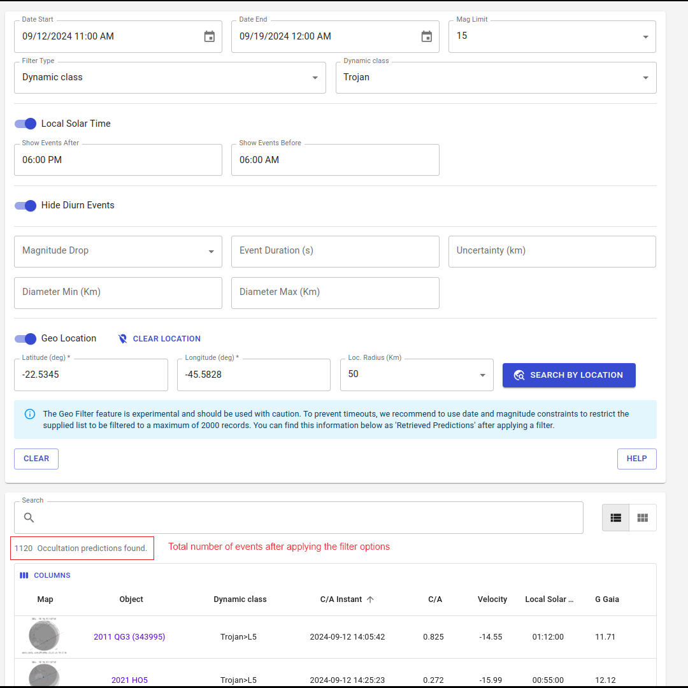

# Filtering events

The web dashboard offers intuitive customization for exploring occultation events, enabling users to easily adjust settings like date and time, visibility limits, geolocation, among other filters. This approach makes advanced filtering of occultation accessible to everyone.

### Date and Time Interval

Allows you to select a specific time and date interval. **Be aware that the selection is based on your local time (timezone of the device) while the closest approach of occultations is given in UTC.**

### Magnitude Limit

Provides an upper magnitude limit.

### Filter Type

There are three ways of filtering objects: by name/principal designation, dynamical class, and dynamical subclass:

- **Object name**: enter the name of the object and select it from the drop-down list. You can select multiple objects. If the name of the object does not appear on the drop-down list, it means that there are no occultations available for that object at the time.
- **Dynamical class**: selects the group of objects that belong to a specific dynamical class. Asteroid dynamical classes (and subclasses) are used as defined by Skybot ([more information](https://ssp.imcce.fr/webservices/skybot/)).
- **Dynamical subclass**: selects the group of objects that belong to a specific subclass.

### Local Solar Time

On by default. When activated, it takes a step further in constraining the closest approach instant to a specific local time (in terms of longitude). Selecting a time range from 6 PM to 6 AM will filter out all events whose closest approach instant is not within this range. This helps, for example, to filter out events occurring during dawn, dusk, or less interesting events whose closest approach occurs at daylight. It strictly considers solar time, not to be confused with the local time taking into account timezones.

### Hide Diurn Events

On by default, it filters out occultations whose paths happen exclusively during daytime and paths that do not cross the Earth at all.

### Duration and Size

Provide options to filter events by the expected magnitude drop (lower limit), the event duration (lower limit, only when the object's diameter is defined) and size of the asteroid (interval, only when the object's diameter is defined).

### Geolocation Filter

_The geolocation filter is experimental and is intended to be the last filter option to be applied._ Since it is computationally costly, we recomend to filter down your results using the previous filtering options to an amount of **at most 2000 events** as indicated in the image below. It can be acomplished for instance using a narrower datetime interval or set of objects.

Latitude and longitude must be presented in degrees. Negative latitudes indicate the South, while positive ones indicate the North. Negative longitudes correspond to the West, while positive ones correspond to the East. The radius represents the distance in kilometers around the provided latitude and longitude.

> **Atention** > Be aware that activating this filter without following the instructions will result either in incomplete results or in timeout by the server.

